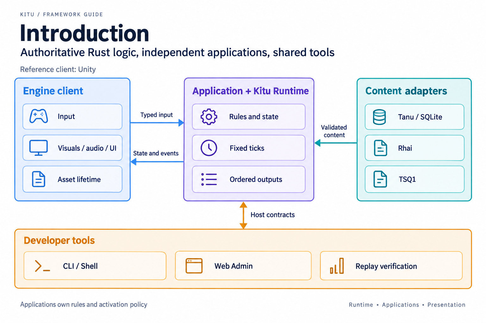
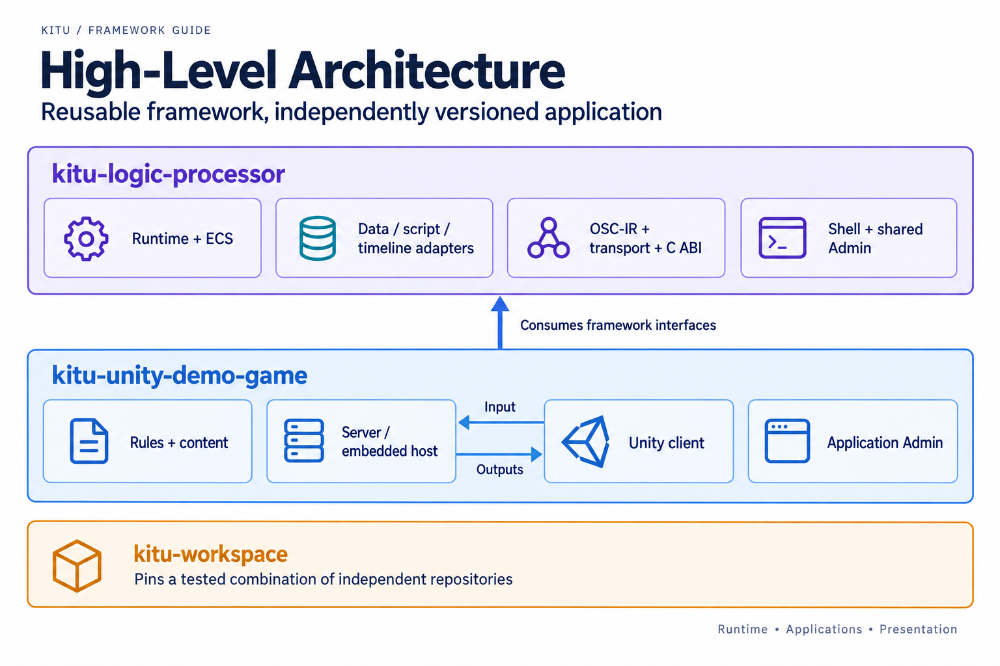
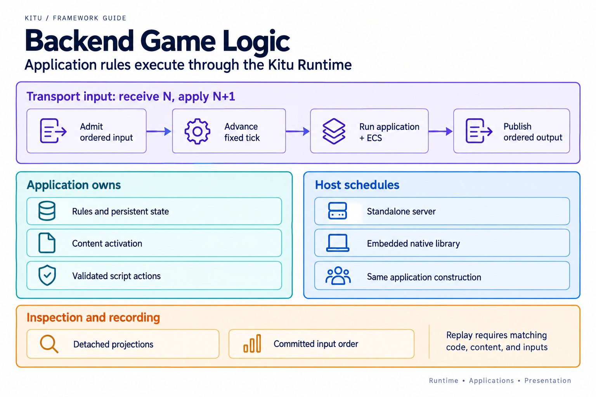
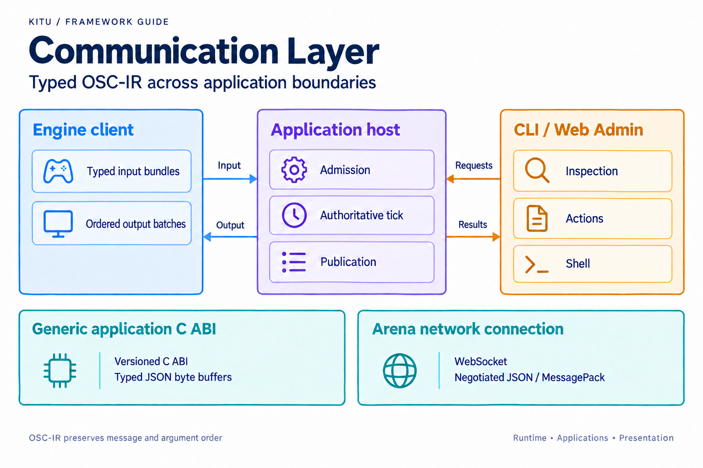
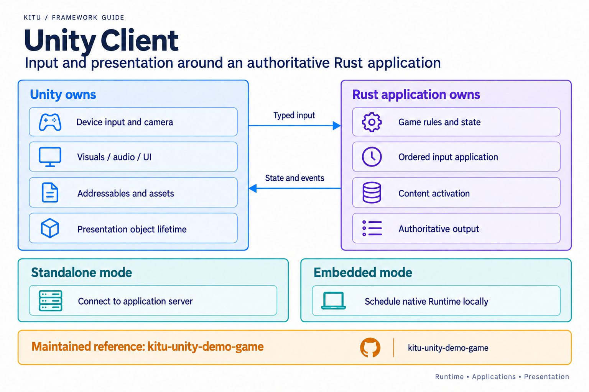
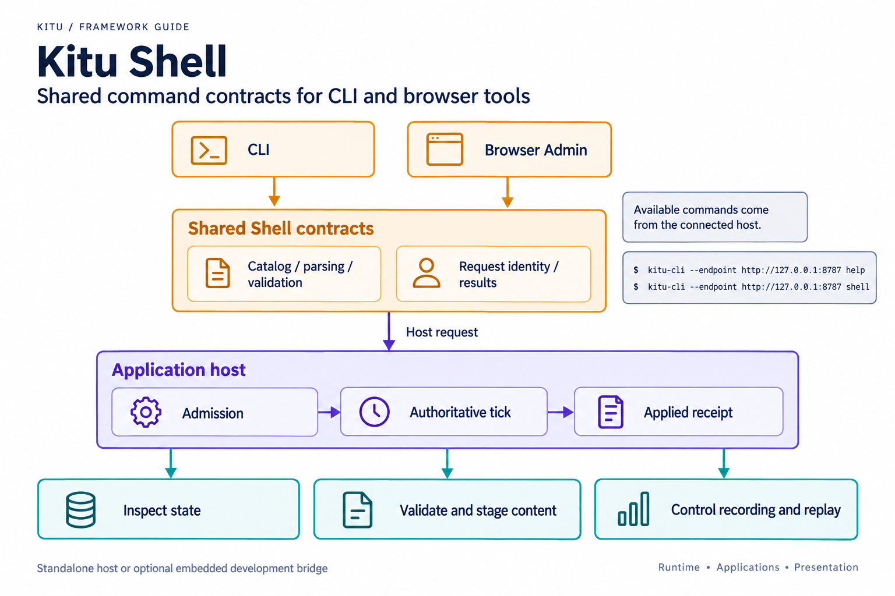
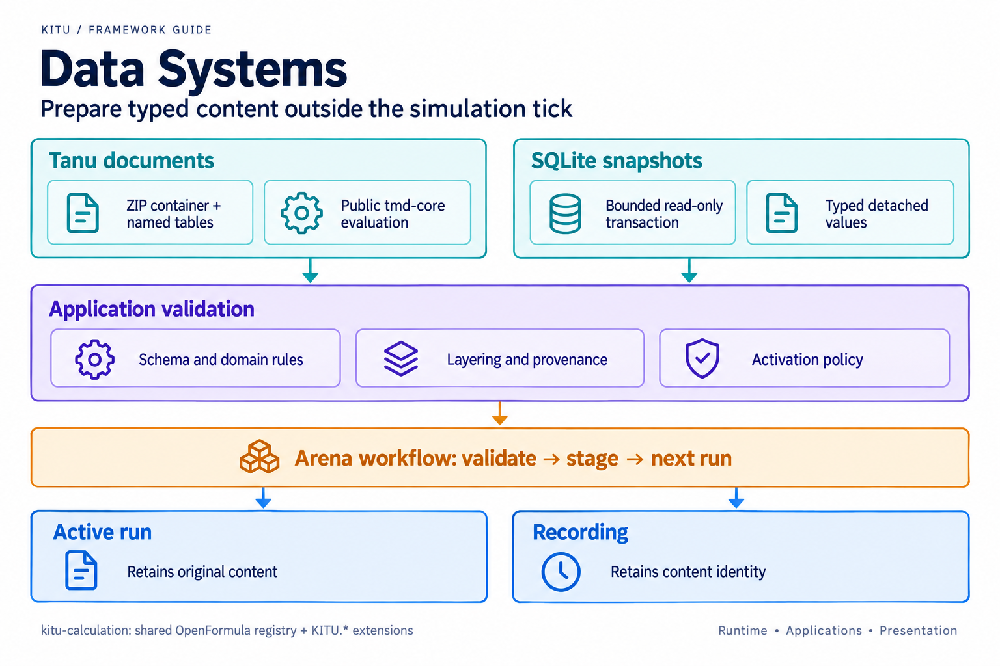
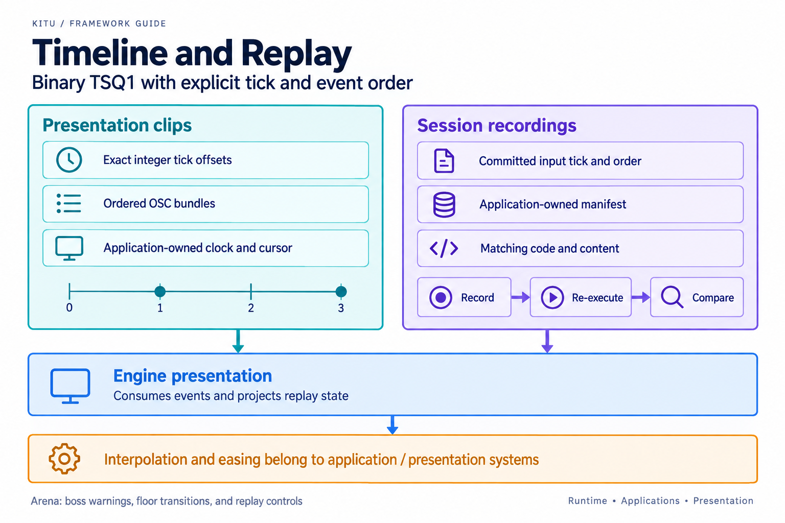

# Kitu Logic Processor

**Kitu**, a Rust–Unity hybrid framework for building deterministic, data‑driven games with a strong focus on developer experience.

## Table of Contents
- [Introduction](#introduction)
- [High-Level Architecture](#high-level-architecture)
- [Crates overview](#crates-overview)
- [Backend Game Logic (Rust)](#backend-game-logic-rust)
- [Communication Layer (OSC + osc-ir + MessagePack)](#communication-layer-osc--osc-ir--messagepack)
- [Unity Client (Presentation Layer)](#unity-client-presentation-layer)
- [Kitu Shell](#kitu-shell)
- [Data Systems (TMD + SQLite)](#data-systems-tmd--sqlite)
- [Timeline & Automation (TSQ1)](#timeline--automation-tsq1)
- [Web Admin Tools](#web-admin-tools)
- [Development Workflow](#development-workflow)
- [Build and Delivery Status](#build-and-delivery-status)
- [Deployment & Distribution](#deployment--distribution)
- [Future Roadmap](#future-roadmap)

## Introduction

Kitu separates **authoritative game logic** (Rust backend) from **presentation** (Unity). The backend runs the simulation, ECS, timelines, and scripting; Unity renders visuals, audio, and UI, and forwards player input as OSC events.

Goals:

- Deterministic, server‑authoritative simulation (even for single‑player)
- Unity as a pure presentation client
- OSC/osc‑ir as a common event protocol across all tools
- Fast iteration via hot‑reloadable data and scripts
- Strong tooling (Shell, Web Admin, CI/replay)
- Minimal coupling between teams (logic / art / design / QA)

Implementation status:

- Endless Arena now runs its complete game rules in the persistent 60 Hz Kitu application; Unity is the default input/presentation client. See the [run instructions](kitu-integration-runner/unity-demo-game/README.md#endless-arena-with-kitu-default), [contract](doc/specs/arena-runtime-contract.md) and [comparison evidence](doc/verification/arena-progression/results.json).
- Arena's real [Tanu tables](apps/demo-game/content/arena.tmd) can be edited in VS Code, evaluated and validated in Admin, and applied to the next run. Active runs retain their saved values and hash. See the [authoring workflow](apps/demo-game/README.md#tanu-parameters) and [evidence](doc/verification/arena-tanu/results.json).
- [Typed SQLite and layered settings](doc/specs/arena-content-sources.md) use the same Arena data contract as Tanu. Admin shows source snapshots, field origins and candidate differences in fixed `base → difficulty → event → debug` order. Explicit reload and next-run application preserve active runs and detached recordings. See the [CLI/Admin/native/Unity verification](doc/verification/arena-sources/README.md).
- [Rhai boss rules](doc/specs/arena-boss-scripts.md) now execute through a bounded host with copied state and validated action requests. CLI and Admin validate editable source and stage it for the next run; recordings retain the exact script source and policy. [Validation evidence](doc/verification/arena-scripts/README.md).
- [TSQ1 presentation timelines](doc/specs/arena-presentation-timelines.md) drive boss warnings and floor transitions from the Runtime clock. CLI and Admin validate real binary clips for the next run; Unity and replay display their authoritative values and positions. [Verification evidence](doc/verification/arena-timelines/README.md).
- [Versioned JSON and MessagePack application connections](doc/specs/arena-application-wire.md) share typed inputs and complete output batches with the native C ABI. Unity checks compatibility before play, preserves producer IDs across reconnects, and applies coherent replay snapshots. [Cross-language, scene and native evidence](doc/verification/arena-wire/README.md).
- The Unity-only reference and frozen inputs remain available. Real [TSQ1 session recording and re-execution](doc/specs/arena-replay.md) preserve exact ticks, ordered inputs and frozen content. Admin now controls play, pause, step and seek while Unity displays the same read-only replay. [Live CLI and browser Shell](doc/specs/live-shell.md) inspect and operate the running host using shared commands and applied results.
- The macOS Unity standalone embeds the complete Arena native library and runs without an external Kitu server. Its optional loopback bridge connects CLI and Admin to that same Runtime. See the [build instructions](kitu-integration-runner/unity-demo-game/README.md#reproduce-the-embedded-macos-build), [host contract](doc/specs/arena-embedded-host.md) and [graphical verification](doc/verification/arena-embedded/README.md).
- Arena loads its material and primitive prefabs through local Addressables and initializes native game rules from the Tanu, Rhai and TSQ1 sources bundled with its macOS Player. A versioned package manifest binds those sources to the visual keys; missing or invalid content fails before gameplay. [Package contract](doc/specs/arena-packaged-content.md) and [relocated Player verification](doc/verification/arena-content/README.md).
- [Arena Inspector](doc/specs/arena-inspection.md) combines game state, entities, minimap, events, presentation cues and host timing from one verified server or embedded Runtime snapshot. Exact replay step/seek and visibly stale error handling preserve the observation context. [Stage 17 verification](doc/verification/arena-inspection/README.md).
- [The delivery matrix](doc/verification/arena-delivery/README.md) links all 18 stages to their Issues, contracts and evidence. Stages 1–17 are merged; Stage 18 build/CI verification and merge are in progress. Historical evidence retains its capture-time status.
- The sections below describe the delivered Arena reference and explicitly marked framework expansion. Production remote operations, multiplayer and CDN delivery remain outside this implementation.
- For the current implemented/partial/staged breakdown, use [doc/architecture.md](doc/architecture.md#current-implementation-staging).
- For the rationale and tradeoffs behind accepted cross-cutting choices, use
  the [architecture decision records](doc/adr/README.md).

## High-Level Architecture

At a high level, Kitu consists of:

- **Rust backend**
  - ECS‑based simulation (Bevy ECS or equivalent)
  - Rhai scripting for game logic DSL
  - TSQ1 timeline playback
  - TMD + SQLite for master data
  - High‑precision game loop and deterministic execution
- **Unity client**
  - Receives OSC events and renders world/UI/audio
  - Sends input as OSC events to backend
  - Loads assets via Addressables
  - Contains no gameplay rules
- **Communication layer**
  - osc‑ir data model (OSC‑compatible IR)
  - Versioned C ABI byte buffers (embedded mode); JSON or MessagePack over WebSocket (Arena network mode)
- **Tooling**
  - Kitu Shell (CLI console)
  - Web Admin (browser UI)
  - CI/replay, automation scripts
- **Applications**
  - `apps/demo-game` is the reference application built on the Kitu framework
  - It hosts the complete Endless Arena reference, Web Admin and app-level scenario tests

The guiding principles are: separation of concerns, determinism, data‑driven design, and event‑based communication.

## Crates overview

For a quick map of the Rust crates that make up the backend, see [doc/crates-overview.md](doc/crates-overview.md).

## Applications

Applications live under `apps/` and consume the reusable framework crates. The
current reference app is `apps/demo-game`, which owns its project action
manifest, admin host service, Docker Compose stack, and scenario tests.

## Backend Game Logic (Rust)

The Rust backend is the authoritative “game universe”.

Core responsibilities:

- Application-owned rules and state, with reusable ECS and Runtime services
- Game loop driven by a fixed-timestep accumulator (`update(dt)` -> deterministic ticks)
- Handling OSC input events from Unity/Web Admin/tests with next-tick application (`N` receive -> `N+1` apply)
- Running bounded Rhai boss decisions in Arena; other rule families are extension work
- Executing TSQ1 timelines
- Loading and validating TMD + SQLite data
- Producing OSC output events for Unity and tools

The backend can run:

- As a **standalone server binary** (for development and headless verification)
- As an **embedded cdylib** inside Unity (for offline or single‑player builds)

Both modes use the same Arena logic and are compared with shared input sequences.

Runtime execution contract: [`doc/specs/runtime-execution-contract.md`](doc/specs/runtime-execution-contract.md).

## Communication Layer (OSC + osc-ir + MessagePack)

Kitu uses OSC semantics and the **osc‑ir** data model as a unified event layer.

- OSC provides hierarchical addresses like `/input/move`, `/game/spawn`, `/ui/dialog`.
- osc‑ir defines a strongly typed, serializable representation of OSC messages.
- In embedded Arena mode, the versioned C ABI receives and returns typed JSON or MessagePack byte buffers.
- Arena network clients negotiate JSON or MessagePack on `/ws/arena` before submitting inputs. See the [application wire contract](doc/specs/arena-application-wire.md).

Typical flows:

- Unity → Backend: `/input/*`, debug commands, UI actions
- Backend → Unity: `/render/*`, `/ui/*`, timeline triggers
- Web Admin ↔ Backend: `/debug/*`, inspection and control events

This event‑driven layer allows loose coupling and shared tooling.

## Unity Client (Presentation Layer)

Unity is treated purely as a **renderer and input source**:

- No game rules or state machines live in MonoBehaviours.
- Gameplay objects project backend state; Unity owns their rendering and asset lifetime.
- Animations, camera moves, VFX, and UI changes are reactions to backend output.
- Input is converted into OSC events and sent to the backend.

Unity responsibilities:

- Visuals (3D/2D, shaders, VFX, lighting)
- Audio playback
- UI rendering (HUD, menus, dialogs)
- Scene/screen transitions
- Asset loading via Addressables (using stable keys provided by backend/data)

This keeps Unity relatively simple and reduces coupling.

## Kitu Shell

Kitu Shell is a runtime developer console that can connect to:

- Local standalone backend
- Remote backend over the network
- Unity‑embedded backend (via a bridge)
- The browser‑based shell inside Web Admin

The shared Arena command catalog supports:

- Inspecting application, World, content, script, timeline and replay state
- Validating and staging data, scripts and presentation clips for the next run
- Sending typed OSC inputs (`osc send`) and application actions with applied receipts
- Running bounded application scenarios and deterministic TSQ1 replay controls

CLI and browser Shell share definitions, parsing and result semantics. Run `help`
against the selected host for its actual catalog. See the [live Shell contract](doc/specs/live-shell.md).

## Data Systems (TMD + SQLite)

Kitu is strongly data‑driven:

- **Tanu Markdown (TMD)** is used for human‑editable master data:
  - Units, items, skills, quests, config tables, etc.
  - Git‑friendly, readable, and diffable.
  - Supports layering/overrides (base, difficulty, event, debug).
- **SQLite** provides bounded typed Arena table snapshots and sparse override layers.
  - Larger catalogs, localization, graphs and analytics are possible application extensions.

The backend:

- Loads configured TMD/SQLite sources and validates explicit reload candidates.
- Reports validation errors through logs, Shell, and Web Admin.
- Provides typed accessors to systems and scripts.
- Stages validated changes for the next run while preserving the active run and recorded versions.

Unity typically does not read TMD/DB directly; it acts on backend results.

## Timeline & Automation (TSQ1)

TSQ1 is Kitu’s **minimal, deterministic timeline format**:

- Stores time-ordered events; Arena preserves exact applied ticks/order for replay and validates presentation clip timing.
- Drives Arena boss warnings and floor transitions. Broader cutscenes and visual authoring are future work.
- Executed entirely in the backend; Unity just consumes resulting events.

Important: **TSQ1 does *not* define tween/easing itself**.
Interpolation and easing are implemented at the application layer:

- Camera or UI interpolators interpret events like “move_to with duration”.
- Backend/Unity code applies linear/eased curves, blending, crossfades.
- TSQ1 remains simple, deterministic, and domain‑agnostic.

Arena's [authoring tool](apps/demo-game/README.md#tsq1-presentation-authoring)
writes actual binary clips. Visual timeline editors remain future work.

## Web Admin Tools

Web Admin is a browser‑based control plane for Kitu:

- Connects to a selected development server or embedded loopback bridge.
- Provides Arena state/entity inspection, a minimap, timelines, observed events and host timing.
- Embeds a browser version of Kitu Shell.
- Validates next-run authoring changes and controls saved replays.

Key capabilities:

- Inspect entities/components and timelines in real time.
- Monitor event streams and logs via WebSocket.
- Validate bounded Arena boss scripts and run shared Shell commands from the browser.
- Visualize world state (logical minimap) for debugging AI and level design.

Authentication, permission roles and production live operations are future work.

Web Admin turns the backend into an observable, controllable system without needing Unity running.

## Development Workflow

Kitu’s workflow focuses on **fast iteration and strong separation**:

- Development should run inside the Dev Container in `.devcontainer/`.
- General Rust and frontend checks run in that container. Apple SDK/native and
  licensed Unity checks run on macOS with the prerequisites in the build recipe.
- Backend developers work in Rust and Rhai, testing logic headlessly.
- Unity developers focus on visuals, UI, asset setup, and Addressables.
- Designers edit TMD, TSQ1, and DB content, often without touching code.
- QA and automation teams use Shell/Web Admin and deterministic replays.

Typical loop:

1. Run backend (standalone or embedded in Unity).
2. Start Unity for visual feedback (if needed).
3. Edit data (TMD/TSQ1/DB) or scripts (Rhai).
4. Validate and stage the next-run version; Unity stays running.
5. Inspect and tweak using Shell/Web Admin.
6. Commit once behavior and visuals are satisfactory.

Headless CI checks the reference, Rust, frontend/WASM and data tools. Arena
Inspector measures tick cost for diagnosis; no CI performance threshold is claimed.

## Build and Delivery Status

Use the [build and verification recipe](doc/specs/arena-build-verification.md)
for shared repository checks and the native/full macOS coordinator. Full Unity
verification requires the pinned licensed Editor and a graphical session; an
unavailable environment is reported separately from passed checks.

The [18-stage delivery matrix](doc/verification/arena-delivery/README.md) links
actual Issues, merged PRs, contracts and compact evidence. Stage 18 final checks
and merge remain pending. Large recordings, binaries and unapproved screenshots
remain local artifacts, with hashes retained in the verification reports.

## Deployment & Distribution

The delivered reference supports a standalone development server and a macOS
ARM64 single-player app with an embedded native Runtime. The app includes local
Addressables and a versioned five-file source package: visual keys, TMD, Rhai and
two TSQ1 clips. SQLite remains an optional external authoring source. The optional
development bridge lets CLI and Admin observe that same embedded Runtime.

Build tools verify package, catalog, bundle and native library identities; the
application checks client/data compatibility. The macOS app uses local development
signing. Release signing/notarization, remote catalogs/CDNs, multiplayer services,
authenticated remote operations and cloud deployment are outside this delivery.

## Future Roadmap

The long‑term roadmap is still being defined. Areas under consideration include:

- Richer Web Admin visualization and editors (TSQ1, ECS, AI, quests).
- Unity editor tooling and VSCode extensions for Kitu formats.
- Advanced multiplayer patterns and sharding.
- AI‑assisted balancing and automated playtesting.
- Ready‑made templates for common game genres.

The implemented Arena work is tracked in [roadmap #129](https://github.com/Nagitch/kitu-logic-processor/issues/129)
and the [delivery matrix](doc/verification/arena-delivery/README.md). The items
above are later extensions, not unfinished Arena migration stages.

Kitu is intended as a long‑term foundation for building modern, data‑driven games with Rust and Unity. This README provides a high‑level architectural overview; individual crates, packages, and tools should provide more detailed API‑level documentation.

The full Endless Arena native C ABI is implemented in
[`apps/demo-game/native`](apps/demo-game/native/README.md). It builds a dynamic or
static library around the same application Runtime, with typed ordered inputs,
complete outputs, inspection, bounded caller-owned buffers and explicit lifecycle.
See the [ABI contract and native verification](doc/specs/arena-native-abi.md).
The macOS Unity standalone bundles this library and optionally exposes the shared
development host to CLI and Admin; see the [embedded host](doc/specs/arena-embedded-host.md).
