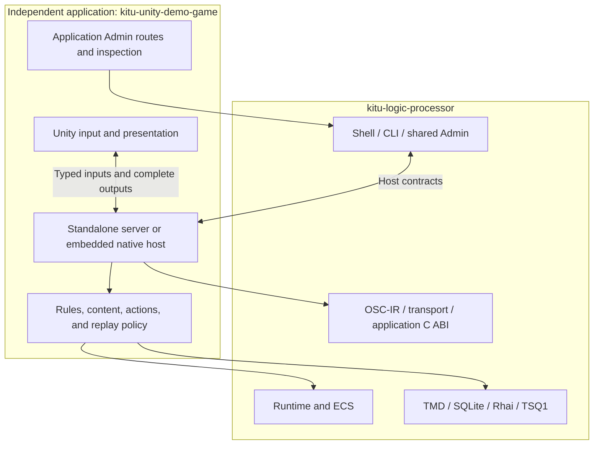

# Kitu Logic Processor

[](https://github.com/Nagitch/kitu-logic-processor/actions/workflows/rust-ci.yml)
[](LICENSE)
[](rust-toolchain.toml)

**Kitu** is a Rust framework for building authoritative, data-driven game logic
with ordered inputs, fixed-tick execution, typed events, and shared developer
tools. Applications own their rules and content; engine clients own presentation
and input. The same application can run in a standalone host or an embedded
native library.

This repository contains the reusable framework. The playable **Endless Arena**
reference, Unity project, application Admin, content, and application verification
live in [kitu-unity-demo-game](https://github.com/Nagitch/kitu-unity-demo-game).

## Table of Contents

- [Introduction](#introduction)
- [Repository Boundary and Applications](#repository-boundary-and-applications)
- [High-Level Architecture](#high-level-architecture)
- [Crates Overview](#crates-overview)
- [Backend Game Logic (Rust)](#backend-game-logic-rust)
- [Communication Layer (OSC + OSC-IR + MessagePack)](#communication-layer-osc--osc-ir--messagepack)
- [Unity Client (Presentation Layer)](#unity-client-presentation-layer)
- [Kitu Shell](#kitu-shell)
- [Data Systems (TMD + SQLite)](#data-systems-tmd--sqlite)
- [Timeline and Replay (TSQ1)](#timeline-and-replay-tsq1)
- [Web Admin Tools](#web-admin-tools)
- [Development Workflow](#development-workflow)
- [Build and Verification](#build-and-verification)
- [Deployment and Distribution](#deployment-and-distribution)
- [Future Directions](#future-directions)
- [Documentation Map](#documentation-map)

## Introduction


Kitu separates authoritative game state from the engine that presents it. Rust
advances the simulation and publishes state and events; Unity renders visuals,
audio, and UI and submits player input. Shell, Admin, and automated tests observe
and operate through shared contracts.

The main goals are:

- Reproducible execution through explicit ticks, ordered inputs, and retained content.
- Reuse of application logic in standalone and embedded hosts.
- Typed OSC-IR messages across runtime, engine, and tooling boundaries.
- Fast iteration through validated data, script, and timeline changes.
- Headless verification, recording, and inspection without requiring Unity.
- Clear ownership between framework, application, presentation, and authoring tools.

Kitu uses its own lightweight `kitu-ecs`. Applications choose when validated
content becomes active; Arena stages authoring changes for the next run while
preserving the active run. Deterministic replay depends on matching execution and
content identities. The diagrams summarize these boundaries; linked contracts
define their detailed behavior and limits.

## Repository Boundary and Applications

The framework and its consumers are independently versioned repositories. The
[kitu-workspace](https://github.com/Nagitch/kitu-workspace) parent pins a tested
combination of them.

| Location | Responsibility |
| --- | --- |
| `crates/` | Reusable runtime, ECS, data/calculation adapters, OSC-IR, actions, transports, Shell, Admin backend, and C ABI. |
| `tools/kitu-web-admin/package/` | Shared `@kitu/admin` Svelte package. |
| `tools/kitu-web-admin/starter/` | Minimal consumer demonstrating the Admin public API. |
| `tools/kitu-cli/` | CLI and interactive Shell for a compatible application host. |
| `tools/kitu-replay-runner/` | Runtime-boundary scenario verification. |
| `tools/kitu-webtransport-gateway/` | Experimental transport-only WebTransport edge gateway. |
| `kitu-integration-runner/scenarios/smoke/` | Application-independent runtime fixtures. |
| `doc/` | Framework architecture, contracts, decisions, and verification notes. |
| [kitu-unity-demo-game](https://github.com/Nagitch/kitu-unity-demo-game) | Arena rules, content, server/native hosts, Unity client, application Admin, and application evidence. |

Applications supply runtime construction, action manifests, domain validation,
content, and engine integration. Framework crates must not import application
implementations or require application fixtures to compile or test.
[ADR 0007](doc/adr/0007-distribute-engine-demo-applications-independently.md)
records this boundary and its compatibility contract.

Endless Arena demonstrates complete game rules running through Kitu, editable
Tanu/SQLite content, bounded Rhai boss decisions, TSQ1 presentation and replay,
server and embedded connections, and CLI/Admin inspection. Its
[README](https://github.com/Nagitch/kitu-unity-demo-game/blob/develop/README.md)
is the entry point for running the game. The
[delivery matrix](https://github.com/Nagitch/kitu-unity-demo-game/blob/develop/docs/verification/arena-delivery/README.md)
retains the 18-stage implementation and verification history.

## High-Level Architecture


The current ownership and dependency structure is:



Runtime owns tick execution and publication. Applications compose the adapters
and decide what events mean. Transports deliver messages without owning game
rules. Engine clients and operator tools consume the resulting projections.
See [architecture](doc/architecture.md) and [detailed flows](doc/detailed-flows.md)
for the full contracts and implementation staging.

## Crates Overview

| Area | Crates | What they provide |
| --- | --- | --- |
| Execution | `kitu-core`, `kitu-ecs`, `kitu-runtime` | Tick primitives, World/resources, system scheduling, persistent application hooks, and ordered publication. |
| Events and actions | `kitu-osc-ir`, `kitu-app-actions`, `kitu-transport` | Typed messages, action catalogs, input metadata, wire codecs, and delivery boundaries. |
| Data and calculation | `kitu-data-tmd`, `kitu-data-sqlite`, `kitu-calculation` | Tanu document evaluation, bounded typed database snapshots, and shared OpenFormula integration. |
| Scripts and timelines | `kitu-scripting-rhai`, `kitu-tsq1` | Bounded script execution, binary presentation clips, and recording conversion. |
| Developer tools | `kitu-shell`, `kitu-web-admin-backend`, `kitu-osc-ir-wasm` | Shared command contracts, Admin backend building blocks, and browser OSC-IR support. |
| Embedding | `kitu-unity-ffi` | Application-independent C ABI and legacy movement bindings. |

The [crate overview](doc/crates-overview.md) maps dependencies. Individual crate
READMEs document their concrete APIs and limits; applications choose how to
combine them.

## Backend Game Logic (Rust)


[`kitu-runtime`](crates/kitu-runtime/README.md) coordinates a lightweight ECS and
persistent application hooks. Its responsibilities include:

- Advancing fixed ticks through `update(dt)` or explicit tick calls.
- Applying transport inputs received at tick `N` on tick `N+1`.
- Validating and sequencing application inputs with producer metadata.
- Dispatching application behavior and ECS systems, then publishing ordered output.
- Exposing detached projections for inspection and committed inputs for recording.

Applications own state and rules such as combat, inventory, and progression.
They install those rules into Runtime rather than adding game-specific behavior
to framework crates. A standalone server and an embedded library can construct
the same application and be compared with the same recorded inputs.

[`kitu-scripting-rhai`](crates/kitu-scripting-rhai/README.md) runs bounded scripts
with copied JSON inputs, explicit limits, and structured diagnostics. Scripts
receive no direct ECS mutation access. Applications define the allowed actions
and validate script results before applying them; Arena uses this for boss rules.

The [Runtime execution contract](doc/specs/runtime-execution-contract.md) defines
ordering and failure semantics. The [generic C ABI](crates/kitu-unity-ffi/README.md)
defines host scheduling, caller-owned buffers, complete output batches, and handle
lifetime for embedded applications.

## Communication Layer (OSC + OSC-IR + MessagePack)


Kitu uses OSC-style hierarchical addresses and the typed **OSC-IR** event model.
Message, bundle, and argument order are part of the contract. Shared wire codecs
preserve integer widths, finite floats, strings, and booleans.

- **Embedded:** the application-owned native library exposes a versioned C ABI.
  The generic application API exchanges typed JSON in caller-owned byte buffers.
  Input admission, authoritative application, inspection, and output consumption
  are separate operations.
- **Network:** the Arena host negotiates typed JSON or MessagePack over WebSocket.
  Application compatibility and producer identities are checked by the host/client.
- **Tools:** CLI and Admin use host inspection, action, and Shell endpoints;
  commands that mutate gameplay follow the application's admission and tick rules.
- **Experimental edge:** the WebTransport gateway carries Kitu Envelope Protocol
  (KEP) frames. It owns transport behavior, not an Arena Runtime or game rules.

Typical event directions are engine inputs toward the host and render/UI output
toward the engine. Exact addresses and supported operations are defined by the
application contract.

See [OSC addressing](doc/specs/osc-addressing.md),
[transport envelopes](doc/specs/transport-envelope.md),
[WebTransport](doc/specs/webtransport-gateway.md), and the demo's
[application wire contract](https://github.com/Nagitch/kitu-unity-demo-game/blob/develop/docs/specs/arena-application-wire.md).

## Unity Client (Presentation Layer)


The maintained Unity client lives in the independent demo repository. Its main
responsibilities are:

- Capturing device input and submitting typed application requests.
- Rendering world state, HUD, menus, camera, animation, VFX, and audio.
- Loading local Addressables and managing presentation assets and scene objects.
- Checking connection compatibility and displaying coherent live/replay state.
- Scheduling the embedded host when running without an external server.

Arena's authoritative game rules remain in Rust. Unity still owns presentation
logic, camera behavior, device handling, and local settings. The frozen Unity-only
reference remains a comparison fixture in the demo rather than a framework
runtime dependency.

Use the [demo setup](https://github.com/Nagitch/kitu-unity-demo-game/blob/develop/README.md)
and [build recipe](https://github.com/Nagitch/kitu-unity-demo-game/blob/develop/docs/specs/arena-build-verification.md)
for Editor, Player, and native-library instructions.

## Kitu Shell


Kitu Shell is a developer console shared by the CLI and browser Admin. It can
operate a standalone application host or an embedded host's optional development
bridge. `kitu-shell` owns catalog definitions, argument validation, quoting,
typed OSC conversion, and request/result contracts. Applications implement the
operations and decide which actions are allowed.

The reference host supports inspection, typed inputs and actions, content/script/
timeline validation and staging, bounded scenarios, and recording/replay controls.
Commands report applied outcomes; uncertain retries retain the same request
identity to avoid executing a mutation twice.

Inside the development environment, build the CLI, then connect to a separately
started compatible application host:

```sh
cargo build --locked -p kitu-cli --bin kitu-cli
target/debug/kitu-cli --endpoint http://127.0.0.1:8787 help
target/debug/kitu-cli --endpoint http://127.0.0.1:8787 inspect application
target/debug/kitu-cli --endpoint http://127.0.0.1:8787 shell
```

`KITU_RUNTIME_URL` supplies the default endpoint. `--help` is available offline;
`help` fetches the selected host's catalog. See the
[live Shell contract](doc/specs/live-shell.md) for identities, retries, and limits.

## Data Systems (TMD + SQLite)


Kitu provides adapters while applications own table schemas, domain validation,
layering, and activation policy:

- [`kitu-data-tmd`](crates/kitu-data-tmd/README.md) reads and writes real Tanu
  containers, evaluates named tables through `tmd-core`, and exposes managed
  Formula definitions and supported cell edits. Its old line-oriented helper is
  retained only for early-fixture compatibility.
- [`kitu-data-sqlite`](crates/kitu-data-sqlite/README.md) reads bounded, typed,
  read-only snapshots of requested tables in one transaction, including WAL data.
  Explicit table specifications and ordering keys produce detached values.
- [`kitu-calculation`](crates/kitu-calculation/README.md) adapts the shared
  OpenFormula registry and explicitly registered `KITU.*` extensions. Parsing,
  references, runtime triggers, and presentation remain with their owning layers.

Prepare and evaluate content outside the simulation tick, then submit detached,
validated values under the application's activation policy. In Arena, the fixed
`base → difficulty → event → debug` layering retains source provenance and
candidate differences. Active runs and recordings retain their original content.

See the demo's [content-source contract](https://github.com/Nagitch/kitu-unity-demo-game/blob/develop/docs/specs/arena-content-sources.md)
and [authoring workflow](https://github.com/Nagitch/kitu-unity-demo-game/blob/develop/app/README.md).

## Timeline and Replay (TSQ1)


[`kitu-tsq1`](crates/kitu-tsq1/README.md) integrates real TSQ1 binary formats for
two related uses:

- **Presentation clips:** bounded ordered OSC bundles with exact tick offsets.
  Simultaneous events retain track/event order. Applications own the clock,
  playback cursor, address validation, and effects.
- **Recordings:** typed OSC-IR conversion with explicit tick/order envelopes and
  application-owned manifests. Applications decide what to record, how to restore
  state, and which execution/content identities are compatible.

Arena uses presentation clips for boss warnings and floor transitions and session
recordings for deterministic re-execution. Its Admin and CLI provide play, pause,
step, and seek while Unity displays the same read-only replay.

TSQ1 does not implement tweening or easing. Application or presentation systems
interpret events and perform interpolation, blending, and crossfades. General
cutscene tooling and visual timeline editors remain future work.

See the [framework replay contract](doc/specs/integration-replay-framework.md),
[demo replay](https://github.com/Nagitch/kitu-unity-demo-game/blob/develop/docs/specs/arena-replay.md),
and [presentation timeline contract](https://github.com/Nagitch/kitu-unity-demo-game/blob/develop/docs/specs/arena-presentation-timelines.md).

## Web Admin Tools

Web Admin provides a browser interface for observing and operating compatible
Kitu application hosts. This repository owns the reusable **`@kitu/admin`** Svelte
package and a minimal SvelteKit starter; applications own their routes, domain
types, host services, and game-specific screens.

The shared package provides:

- An instance-scoped Admin client and context helpers.
- Shell, controls, standard pages, styling, and navigation configuration.
- HTTP/WebSocket integration and the OSC-IR WASM loader contract.
- Public entrypoints for client, UI, pages, WASM, and CSS.

The Arena consumer adds game-state/entity inspection, a minimap, presentation
cues, host timing, content authoring, and replay controls. Its server or embedded
loopback bridge exposes the observed Runtime; the starter alone does not start a
game host. Production authentication, permission roles, and remote live operations
remain outside the delivered local-development workflow.

See [Web Admin setup](tools/kitu-web-admin/README.md), the
[package API](tools/kitu-web-admin/package/README.md), and the
[starter](tools/kitu-web-admin/starter/README.md).

## Development Workflow

Use the repository's [Dev Container](.devcontainer/devcontainer.json) for ordinary
Rust and frontend development. The configured toolchain is Rust **1.96.0**, Python
**3.11 or later**, Node **24**, and pnpm **11.9.0**. Admin builds also require the
Rust `wasm32-unknown-unknown` target. Native Apple SDK and licensed Unity checks
run on a supported host through the demo's own build tooling.

A typical application iteration is:

1. Start the application host, either standalone or embedded in Unity.
2. Connect CLI/Admin and, when needed, the presentation client.
3. Edit application-owned Tanu data, scripts, or TSQ1 clips.
4. Validate and stage the candidate for the next run.
5. Inspect results and replay recorded input against matching content and code.
6. Run framework or application checks in the repository that owns the change.

Normal demo setup uses a pinned Kitu revision. Joint development uses the demo's
explicit `--kitu-path` override and an isolated effective demo copy so Rust,
shared Admin, WASM, and native builds use the selected framework together. The
workspace records tested combinations rather than automatically following each
child repository's latest branch.

For contributor conventions, see [Development Workflow](doc/dev-workflow.md).

## Build and Verification

Run commands from this repository inside the development environment. A focused
Rust check is:

```sh
cargo test --locked --workspace
```

To run the framework's ordinary CI scopes and retain logs and a report:

```sh
python3 tools/verify-repository.py --scope all --evidence .tmp/framework-1
```

Choose a fresh, absent evidence directory for every attempt. Individual scopes
are `fmt`, `test`, `clippy`, `docs`, `tools`, and `frontend`. The frontend scope
installs, checks, tests, and builds the shared Admin package and checks/builds the
starter using their own lockfiles. Framework verification requires no demo checkout.

| Verification layer | Coverage |
| --- | --- |
| [Framework CI](.github/workflows/rust-ci.yml) | Formatting, Rust tests/lints/docs, Python tool tests, runtime smoke fixture, shared Admin, and starter. |
| [Demo compatibility](.github/workflows/demo-compatibility.yml) | A fixed demo revision tested against the Kitu change: Rust tests, frontend, data, and macOS native checks. |
| [Application verification](https://github.com/Nagitch/kitu-unity-demo-game/blob/develop/docs/specs/arena-build-verification.md) | Demo content, application scenarios, licensed Unity/Player acceptance, and complete macOS delivery. |

[`tools/demo-compatibility.json`](tools/demo-compatibility.json) pins the downstream
test application; it is not an automatic branch-following dependency. The
experimental gateway is a separate Cargo workspace with its own
[checks](tools/kitu-webtransport-gateway/README.md). Passing framework CI does not
imply gateway, hosted Unity, or complete application Player acceptance.

## Deployment and Distribution

Kitu supplies reusable source interfaces. Rust crates remain `publish = false`;
the shared Admin package is consumed from framework source. This workflow does
not depend on crates.io or npm publication.

Applications own their server binaries, native-library factories, content
packaging, and engine builds. The maintained Arena delivery includes a standalone
development server and a macOS ARM64 Player with an embedded native Runtime,
local Addressables, and packaged Tanu, Rhai, and TSQ1 sources. An optional loopback
bridge lets CLI and Admin observe that embedded Runtime.

See the demo's [embedded-host contract](https://github.com/Nagitch/kitu-unity-demo-game/blob/develop/docs/specs/arena-embedded-host.md)
and [packaged-content contract](https://github.com/Nagitch/kitu-unity-demo-game/blob/develop/docs/specs/arena-packaged-content.md).
Release signing/notarization, CDN delivery, multiplayer services, authenticated
remote operations, and cloud deployment remain application/product work beyond
that reference delivery.

Application-specific specifications and historical evidence moved with the demo.
Existing Issues, PRs, release tags, and earlier commits retain their original URLs
and meaning; the repository split did not rewrite release history or change
ABI/network identifiers.

## Future Directions

Potential extensions include richer Admin editors and visualization, broader
presentation authoring, additional engine consumers, multiplayer integrations,
and reusable application templates. These are directions rather than a committed
release schedule or claims of implemented capability.

The framework's scope remains reusable runtime and tooling contracts. Game rules,
content, and product-specific services belong to applications. Consult
[architecture staging](doc/architecture.md#current-implementation-staging) and the
[architecture decisions](doc/adr/README.md) before extending those boundaries.

## Documentation Map

- [Architecture](doc/architecture.md), [crate map](doc/crates-overview.md), and [detailed flows](doc/detailed-flows.md)
- [Runtime execution](doc/specs/runtime-execution-contract.md)
- [OSC addressing](doc/specs/osc-addressing.md) and [transport envelopes](doc/specs/transport-envelope.md)
- [Replay framework](doc/specs/integration-replay-framework.md) and [live Shell](doc/specs/live-shell.md)
- [Generic application C ABI](crates/kitu-unity-ffi/README.md)
- [Shared Web Admin](tools/kitu-web-admin/README.md)
- [Architecture decisions](doc/adr/README.md) and [development conventions](doc/dev-workflow.md)
- [Independent Unity demo](https://github.com/Nagitch/kitu-unity-demo-game/blob/develop/README.md) and [its verification recipe](https://github.com/Nagitch/kitu-unity-demo-game/blob/develop/docs/specs/arena-build-verification.md)
