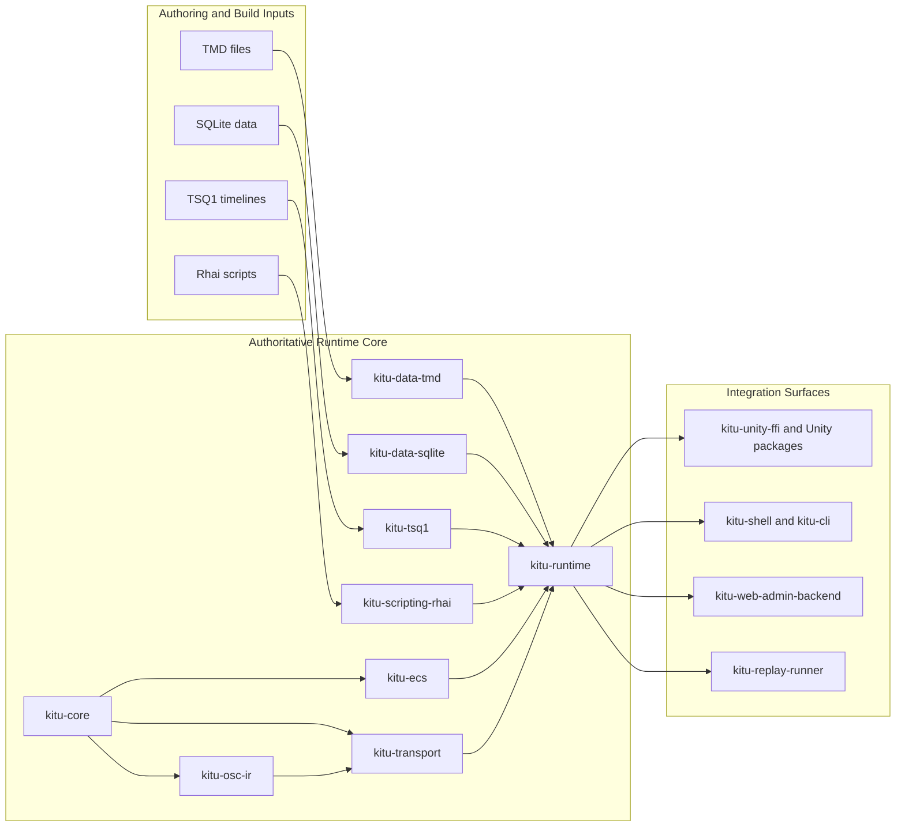
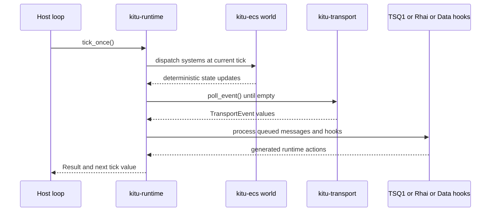
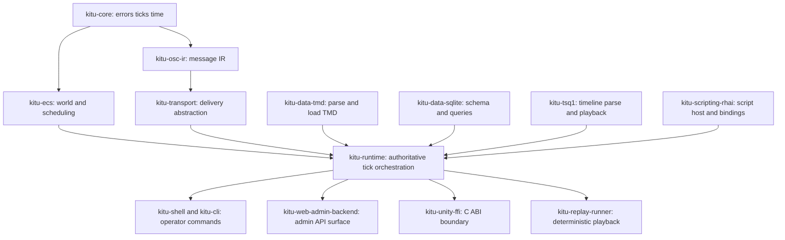
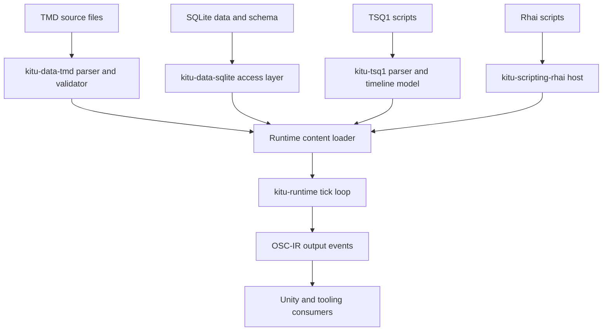
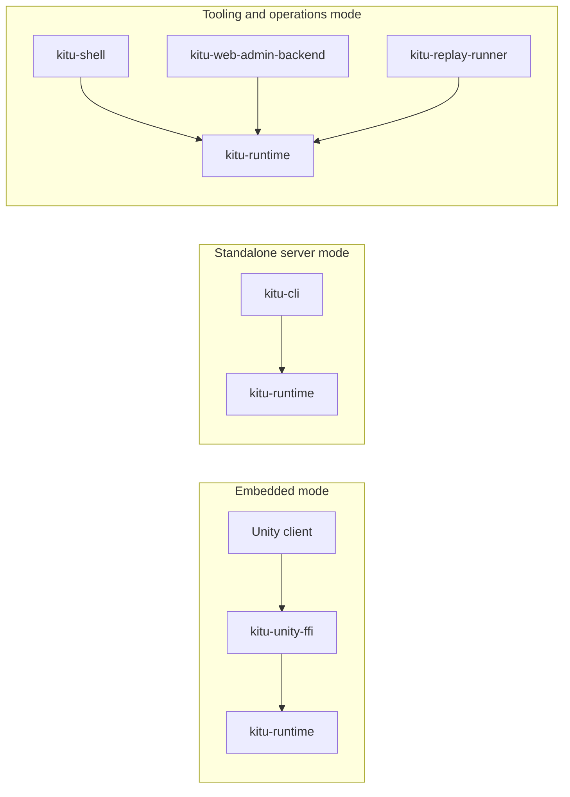

# Kitu MVP Architecture Documentation

This document is the primary architecture source of truth for `kitu-logic-processor`.
It defines the current MVP architecture, explicit architectural decisions, current assumptions, and open questions.
For a quick crate index, use [`doc/crates-overview.md`](./crates-overview.md).

## Table of contents

- [Overview](#overview)
- [Scope and non-goals](#scope-and-non-goals)
- [System architecture](#system-architecture)
- [Runtime execution model](#runtime-execution-model)
- [Tick and event flow](#tick-and-event-flow)
- [Determinism and invariants](#determinism-and-invariants)
- [Module / crate responsibilities](#module--crate-responsibilities)
- [Integration boundaries](#integration-boundaries)
- [Data/content pipeline](#datacontent-pipeline)
- [Deployment modes](#deployment-modes)
- [Use case list](#use-case-list)
- [Open questions / deferred decisions](#open-questions--deferred-decisions)

## Overview

Kitu separates **authoritative runtime logic** (Rust) from **presentation and platform integration** (Unity, shell, web tools). The same runtime behavior should be reusable in both embedded and standalone modes.

### Architectural decisions (current)

- `doc/architecture.md` is the detailed architecture specification.
- Runtime orchestration is tick-based (`kitu-runtime` + `kitu-core::Tick`).
- OSC-like IR (`kitu-osc-ir`) is the shared event model across runtime boundaries.
- Transport is abstracted (`kitu-transport`) and must not contain gameplay rules.
- Unity integration is via FFI boundary (`kitu-unity-ffi`) and should remain presentation-oriented.

### Current assumptions

- The workspace crate split in `Cargo.toml` reflects intended production boundaries.
- Several crates are intentionally skeletons; architecture must still constrain future implementation direction.
- TSQ1, TMD, SQLite, and Rhai are data/content inputs that should not bypass runtime validation boundaries.

## Scope and non-goals

### In scope

- Runtime loop boundaries and execution ordering.
- Determinism constraints for simulation and replay.
- Crate-level responsibility boundaries for current workspace crates.
- Integration boundaries for Unity, shell/admin tools, and transport/protocol.
- Data/content flow from authoring formats into runtime behavior.

### Non-goals

- Final wire protocol details for every transport backend (e.g., exact WS framing).
- Full gameplay rule design for specific games built on Kitu.
- Unity scene-level implementation details and art/content production workflows.
- Final persistence model for save/load and cross-version migration.

## System architecture

Kitu is organized as a layered architecture where core primitives sit at the bottom, orchestration in the middle, and integration/tooling at the boundary.

For diagram readability: arrows in dependency diagrams mean "depends on", while arrows in architecture flow diagrams mean information or control flow.

## Runtime execution model

The runtime model is **authoritative, tick-driven, and deterministic-first**.

### Tick driver

- `kitu-runtime` owns the `Tick` counter and increments exactly once per successful `tick_once`.
- `RuntimeConfig.tick_rate_hz` defines fixed tick cadence and frame duration.
- Runtime loop is expected to run at fixed-step simulation; rendering side may interpolate externally.

### Per-tick execution phases (current MVP)

1. Freeze the committed input batch for the current tick.
2. Dispatch ECS systems for the current tick.
3. Emit runtime outputs/events produced by this tick.
4. Poll transport events and enqueue newly received inputs for the next committed batch.
5. Increment tick counter.

### Runtime extension points (planned but bounded by this architecture)

- TSQ1 timeline playback hooks execute within deterministic tick context.
- Rhai script invocation occurs through runtime-owned APIs, not direct arbitrary host callbacks.
- Data reload hooks (TMD/SQLite) must be scheduled at explicit safe points, not asynchronously mutating world state mid-phase.

## Tick and event flow

The per-tick order must remain explicit and stable, because replay/debug tools depend on it.

### Input Application Timing

Inputs received during tick `N` are not applied immediately to authoritative simulation state.
They are queued and become part of the committed input batch for tick `N+1`.
This keeps tick evaluation deterministic and independent from transport polling timing.

This timing rule supports deterministic replay, stable network synchronization, and transport timing independence.

### Tick-based processing order requirements

- Input intake for tick `N` must be applied in a deterministic order before advancing to `N+1`.
- ECS dispatch ordering must be stable for a given build/configuration.
- Tick increment is the final phase of `tick_once`.
- Tooling-triggered operations (shell/admin/replay) must enter the same message/event queue path as gameplay input.

## Determinism and invariants

This section defines mandatory invariants for runtime and tools.

### Determinism requirements

- Equal initial state + equal ordered input stream + equal content version must produce equal tick-by-tick state transitions.
- Runtime-relevant decisions must be tick-indexed; wall-clock time should not alter simulation outcomes.
- Transports may differ by implementation, but must preserve semantic ordering as observed by runtime.

### Core invariants

- `Tick` is monotonic and never decremented.
- Runtime state mutates only through runtime-controlled execution phases.
- Transport layer does not apply gameplay logic.
- Unity side does not become authoritative for gameplay decisions.
- Replay system consumes and reproduces event streams rather than patching ECS state directly.

### Assumptions still to validate

- Exact deterministic contract for floating-point heavy systems across platforms.
- Event ordering guarantees for future network transport backends.
- Hot reload consistency model when content changes during active sessions.

## Module / crate responsibilities

For dependency details, see `doc/crates-overview.md`. This section defines allowed responsibility boundaries.

### Responsibility rules by boundary

- `kitu-core`: foundational types only; no transport/runtime orchestration.
- `kitu-osc-ir`: protocol-neutral message model; no game rules or transport coupling.
- `kitu-transport`: sending/receiving and connectivity events only.
- `kitu-runtime`: only crate allowed to own authoritative tick loop orchestration.
- `kitu-data-*`, `kitu-tsq1`, `kitu-scripting-rhai`: adapt data/content into runtime-consumable structures and commands.
- `kitu-shell`, `kitu-web-admin-backend`, `kitu-unity-ffi`, replay tools: integration adapters around runtime, not alternate runtime implementations.

## Integration boundaries

### Unity/client side boundary

- Unity and future client packages are presentation/input boundaries.
- Unity sends input intents and receives runtime output events.
- `kitu-unity-ffi` must provide a stable ABI and deterministic handoff into runtime-owned processing.
- Client-side prediction, if introduced later, must be explicitly documented as non-authoritative.

### Shell / admin / tooling boundary

- Shell and admin commands are operator/tooling channels.
- They may inspect state and send commands, but command effects must flow through runtime event pathways.
- Tooling access control, auditability, and mutation safety are deployment concerns, not runtime loop concerns.

### Transport/protocol boundary

- Protocol semantics are represented in `kitu-osc-ir`.
- Serialization/wire details are transport adapter concerns.
- Runtime behavior must not depend on one specific transport technology (local channel, WS, TCP, etc.).

## Data/content pipeline

Content is data-driven, but runtime remains authoritative for application and timing.

### Pipeline boundary rules

- TMD: authoring-friendly source format; parsed and validated before runtime use.
- SQLite: structured storage and query boundary; runtime consumes validated records, not raw SQL strings from clients.
- TSQ1: timeline behavior represented as deterministic, tick-aligned steps.
- Rhai: scripted behavior must execute through constrained host APIs.
- Runtime: final authority deciding when and how loaded content affects simulation state.

## Deployment modes

Kitu targets multiple deployment/integration modes while preserving one authoritative logic implementation.

### Deployment assumptions

- Embedded and standalone modes share the same runtime logic path as much as possible.
- Replay and diagnostics should operate in both local and CI contexts.
- Production hardening details (network auth, process isolation, secrets) are deferred to implementation documents.

## Use case list

This list tracks scenario coverage and should remain aligned with runtime and tooling boundaries.

### A. Boot / main loop

- UC-01: Game boot & scene initialization
- UC-02: Main loop (per-tick simulation & rendering updates)

### B. Player control / movement

- UC-10: Player movement
- UC-11: Camera follow

### C. Battle / enemies / damage

- UC-20: Enemy spawn
- UC-21: Player melee attack
- UC-22: Enemy AI actions
- UC-23: HP decrease & death handling

### D. Status / items / level

- UC-30: Experience & level up
- UC-31: Item pickup
- UC-32: Item usage

### E. Quests / flags / scenario

- UC-40: Quest progression
- UC-41: Scenario flag branching

### F. Presentation (TSQ1)

- UC-51: Skill presentation (short TSQ1)

### G. UI / menu

- UC-60: HUD updates
- UC-61: Pause / menu

### H. Data-driven / hot reload

- UC-70: Apply TMD changes
- UC-72: Apply Rhai script changes

### I. Debug / tools / replay

- UC-80: Run debug command from Shell
- UC-81: Monitor state in Web Admin
- UC-82: Replay (input playback)
- UC-83: Run Kitu Shell commands from Web Admin

### J. Save / load

- UC-90: Save/load data

## Open questions / deferred decisions

1. **Protocol finalization**: How strictly to lock OSC address schema and MessagePack envelope shape.
2. **Deterministic numerics**: Policy for float determinism across CPU/OS combinations.
3. **Hot reload model**: Whether changes apply at tick boundaries only, and rollback strategy on validation errors.
4. **Script sandboxing**: Security and resource limits for Rhai in development vs production.
5. **Persistence model**: Save/load snapshot granularity and schema evolution policy.
6. **Web admin security**: Authentication/authorization model for remote operations.
7. **Unity package layout**: Final package boundaries and release/versioning strategy under `unity/`.
