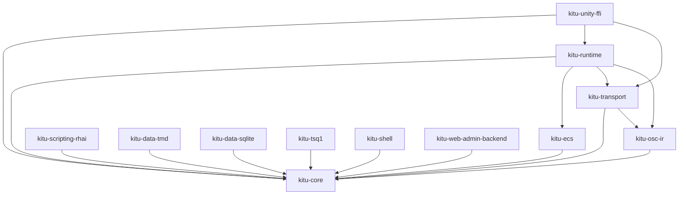

# Kitu crates overview

This document summarizes the Rust crates under `crates/` in the `kitu-logic-processor` workspace. Use it as a quick reference for responsibilities, entry points, and how the crates compose the runtime.

## Quick map

| Crate | Purpose | Key dependencies |
| --- | --- | --- |
| `kitu-core` | Foundational types (errors, ticks, timestamps) shared across all crates. | – |
| `kitu-ecs` | Minimal ECS wrapper and scheduler used by the runtime loop. | `kitu-core` |
| `kitu-osc-ir` | Core OSC/IR message types that travel across transports. | `kitu-core` |
| `kitu-transport` | Message transport abstraction (local channel, network adapters). | `kitu-core`, `kitu-osc-ir` |
| `kitu-runtime` | Tick-based orchestrator that wires ECS, transports, and future data/script layers. | `kitu-core`, `kitu-ecs`, `kitu-transport`, `kitu-osc-ir` |
| `kitu-scripting-rhai` | Rhai integration layer (script hosts, bindings, helpers). | `kitu-core` |
| `kitu-data-tmd` | Parser/loader for TMD data definitions. | `kitu-core` |
| `kitu-data-sqlite` | SQLite-backed data store utilities and schema helpers. | `kitu-core` |
| `kitu-tsq1` | TSQ1 timeline AST and playback utilities. | `kitu-core` |
| `kitu-shell` | CLI shell primitives for driving the runtime during development. | `kitu-core` |
| `kitu-web-admin-backend` | Backend pieces for the browser-based admin (HTTP/WS glue). | `kitu-core` |
| `kitu-unity-ffi` | C-compatible FFI surface for embedding the runtime in Unity. | `kitu-core`, `kitu-runtime`, `kitu-transport` |

## Dependency graph

## Crate notes

### `kitu-core`
- Defines cross-crate primitives such as `KituError`, the `Result` alias, and tick/timestamp handling.
- Keep error variants and time utilities cohesive here so downstream crates do not redefine them.

### `kitu-ecs`
- Provides the lightweight ECS world, scheduling, and `System` trait used by the runtime loop.
- Intended to stay thin: it should be safe to swap the backing ECS implementation if needed.

### `kitu-osc-ir`
- Hosts the OSC-inspired intermediate representation used for runtime I/O.
- Types here are intentionally transport-agnostic and should remain stable for tooling interoperability.

### `kitu-transport`
- Defines the `Transport` trait plus concrete adapters (e.g., in-memory channels, future WebSocket clients).
- Responsible only for delivery; domain-specific routing lives in `kitu-runtime` or higher layers.

### `kitu-runtime`
- Central coordinator that advances ticks, dispatches ECS systems, and consumes `Transport` events.
- Future extensions will plug in TSQ1 playback, scripting hooks, and data loaders via this crate.

### `kitu-scripting-rhai`
- Builds the Rhai execution environment and exposes safe bindings for runtime state.
- Scripts should access gameplay data through APIs defined here instead of touching ECS internals directly.

### `kitu-data-tmd`
- Parses TMD authoring assets into strongly typed structures ready for validation and loading.
- Keep transformations and schema evolution logic here to isolate game/runtime code from raw TMD layout changes.

### `kitu-data-sqlite`
- Encapsulates SQLite schema management, migrations, and query helpers.
- Designed to be shared by build pipelines and runtime code that consume the same data store.

### `kitu-tsq1`
- Implements the TSQ1 timeline model and playback helpers for driving presentation events.
- Should remain deterministic and testable, with output expressed as OSC/IR messages.

### `kitu-shell`
- Houses the core shell commands and adapters used by local CLI tools.
- Focuses on developer ergonomics: diagnostics, replay hooks, and scripting entry points belong here.

### `kitu-web-admin-backend`
- Provides backend utilities for the web admin UI (HTTP/WS endpoints, auth hooks, live inspection APIs).
- Should stay slim and delegate game logic to the runtime via transports or direct bindings.

### `kitu-unity-ffi`
- Exposes a stable C ABI for embedding the runtime in Unity as a `cdylib`.
- Responsible for marshalling between Unity types/buffers and the Rust runtime API.
